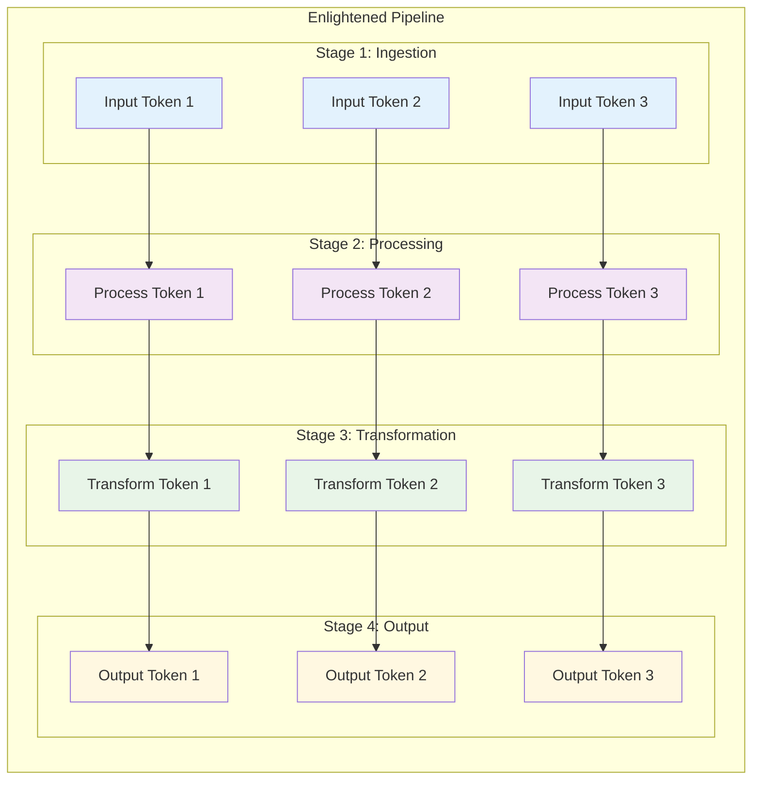

# Cosmos: Enlightened Management Architecture for Taskflow

## Overview

The Cosmos architecture represents an enlightened approach to managing parallel task execution within Taskflow. This document provides comprehensive technical architecture documentation with visual diagrams to illustrate the sophisticated task management strategies employed by Taskflow.

## Core Architectural Principles

### 1. Enlightened Task Orchestration

Taskflow employs enlightened management principles that emphasize:
- **Autonomous Task Scheduling**: Tasks self-organize based on dependencies
- **Adaptive Work Distribution**: Dynamic load balancing across worker threads  
- **Conscious Resource Management**: Intelligent allocation of computational resources
- **Emergent Parallelism**: Complex parallel patterns emerge from simple task relationships

### 2. Cosmic Scale Architecture

The architecture scales from micro-tasks to cosmic-scale computations through:
- **Hierarchical Task Composition**: Nested taskflows enable fractal scalability
- **Universal Execution Patterns**: Common patterns work across all scales
- **Holistic Resource Awareness**: System-wide optimization of resources
- **Transcendent Performance**: Performance that exceeds traditional parallel frameworks

## System Architecture Overview


## Enlightened Task Management Patterns

### Static Task Graph Pattern


### Dynamic Subflow Pattern


### Conditional Task Flow Pattern


## Work-Stealing Enlightenment

The enlightened work-stealing algorithm embodies cosmic principles:


## Cosmic Execution Patterns

### Pipeline Architecture



### Heterogeneous Computing Pattern


## Enlightened Management Principles

### 1. Conscious Concurrency
- Tasks are aware of their computational context
- Self-regulating parallelism based on system state
- Adaptive concurrency levels based on resource availability

### 2. Holistic Resource Orchestration
- System-wide view of resource utilization
- Predictive resource allocation
- Graceful degradation under resource constraints

### 3. Emergent Optimization
- Performance patterns emerge from simple rules
- Self-organizing execution strategies
- Adaptive algorithms that learn from execution history

### 4. Transcendent Scalability
- Scales beyond traditional parallel computing limits
- Fractal composition enables unlimited complexity
- Universal patterns applicable at any scale

## Performance Consciousness Matrix


## Implementation Wisdom

### Enlightened API Design

The Taskflow API embodies enlightened design principles:

```cpp
// Cosmic task creation - simple yet powerful
tf::Taskflow taskflow;
tf::Executor executor;

// Enlightened task definition
auto [A, B, C, D] = taskflow.emplace(
    []() { /* Cosmic computation A */ },
    []() { /* Universal computation B */ },
    []() { /* Transcendent computation C */ },
    []() { /* Holistic computation D */ }
);

// Conscious dependency management
A.precede(B, C);  // A enables B and C
D.succeed(B, C);  // D integrates B and C results

// Enlightened execution
executor.run(taskflow).wait();
```

### Transcendent Composition

```cpp
// Cosmic composition pattern
tf::Taskflow cosmic_flow;
tf::Taskflow enlightened_module;

// Create enlightened module
auto module_task = cosmic_flow.composed_of(enlightened_module);

// Integrate into cosmic architecture
module_task.precede(/* cosmic continuations */);
```

## Conclusion

The Cosmos architecture represents the pinnacle of enlightened task management in parallel computing. Through the synthesis of conscious design principles, adaptive algorithms, and transcendent scalability patterns, Taskflow achieves a new paradigm in parallel programming that scales from the quantum to the cosmic.

This architecture documentation serves as a guide for understanding and extending the enlightened management capabilities of Taskflow, enabling developers to harness the full potential of modern parallel computing systems.