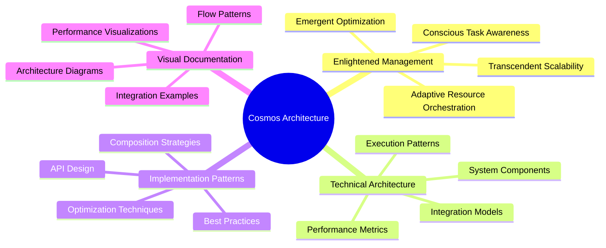

# Cosmos: Comprehensive Architecture Documentation Index

Welcome to the Cosmos architecture documentation for Taskflow - a comprehensive guide to understanding the enlightened management principles and technical architecture of the Taskflow parallel programming framework.

## Documentation Overview

This documentation set provides three complementary views of Taskflow's architecture:

### 1. [Cosmos Architecture Overview](cosmos-architecture.md)
The foundational document that introduces the Cosmos architecture and enlightened management principles:

- **Core Architectural Principles**: Enlightened task orchestration and cosmic scale architecture
- **System Architecture Overview**: Complete system component hierarchy with Mermaid diagrams
- **Enlightened Task Management Patterns**: Static, dynamic, and conditional task flow patterns
- **Work-Stealing Enlightenment**: Advanced work-stealing algorithms with cosmic principles
- **Cosmic Execution Patterns**: Pipeline and heterogeneous computing architectures
- **Performance Consciousness Matrix**: Multi-dimensional performance analysis
- **Implementation Wisdom**: Practical code examples and patterns

### 2. [Enlightened Management Principles](enlightened-management.md)
Deep dive into the philosophical and technical foundations of enlightened parallel computing:

- **Conscious Task Awareness**: How tasks become aware of their computational environment
- **Adaptive Resource Orchestration**: Dynamic resource allocation with feedback loops
- **Emergent Optimization Patterns**: Complex behaviors emerging from simple rules
- **Hierarchical Task Consciousness**: Multi-level awareness in task execution
- **Conscious Scheduling Algorithms**: Advanced scheduling with integrated knowledge
- **Adaptive Work-Stealing**: Enlightened load balancing strategies
- **Performance Enlightenment Metrics**: Consciousness quotient and enlightenment indicators

### 3. [Technical Architecture Diagrams](technical-architecture-diagrams.md)
Comprehensive visual reference with detailed Mermaid diagrams covering:

- **Core Architecture Overview**: Complete system layer visualization
- **Task Graph Structures**: Basic to complex task relationship patterns
- **Execution Engine Architecture**: Worker threads, queues, and synchronization
- **Advanced Patterns**: Subflows, conditional flows, and pipeline architectures
- **Parallel Algorithm Patterns**: Parallel for, reduction, and other common patterns
- **GPU Integration Architecture**: CPU-GPU heterogeneous computing diagrams
- **Performance Monitoring**: Timeline visualization and resource utilization matrices

## Key Concepts and Relationships

## Architecture Layers

The Cosmos architecture is organized into distinct layers, each with specific responsibilities:

| Layer | Purpose | Key Components | Documentation |
|-------|---------|---------------|---------------|
| **Application Layer** | User interface and task definition | API, DSL, Algorithm Templates | [Technical Diagrams](technical-architecture-diagrams.md#system-component-hierarchy) |
| **Graph Management** | Task graph construction and composition | Taskflow, Task Graph, Composition | [Cosmos Overview](cosmos-architecture.md#system-architecture-overview) |
| **Execution Engine** | Task scheduling and execution control | Executor, Scheduler, Work-Stealing | [Enlightened Management](enlightened-management.md#conscious-scheduling-algorithms) |
| **Runtime Layer** | Thread management and synchronization | Worker Threads, Task Queues, Sync | [Technical Diagrams](technical-architecture-diagrams.md#executor-and-worker-thread-management) |
| **System Layer** | Operating system and hardware interface | OS, Hardware, Memory System | [Performance Metrics](enlightened-management.md#enlightened-performance-metrics) |

## Execution Patterns Reference

### Static Task Patterns
- **Linear Chain**: Sequential task dependencies
- **Fork-Join**: Parallel execution with synchronization points
- **Diamond Pattern**: Complex interdependencies with merge points

Reference: [Task Graph Structures](technical-architecture-diagrams.md#task-graph-structures)

### Dynamic Task Patterns
- **Subflow Creation**: Dynamic task generation at runtime
- **Conditional Execution**: Branch-based execution paths
- **Adaptive Composition**: Runtime task graph modification

Reference: [Dynamic Subflow Pattern](cosmos-architecture.md#dynamic-subflow-pattern)

### Advanced Execution Patterns
- **Pipeline Processing**: Multi-stage data processing pipelines
- **Heterogeneous Computing**: CPU-GPU collaborative execution
- **Parallel Algorithms**: Optimized patterns for common operations

Reference: [Advanced Patterns](technical-architecture-diagrams.md#advanced-patterns)

## Performance and Optimization

### Enlightened Performance Metrics
- **Consciousness Quotient (CQ)**: Overall system enlightenment measure
- **Task Efficiency**: Work completion vs. overhead ratio
- **Resource Utilization**: Optimal resource usage patterns
- **Load Balance Index**: Work distribution evenness metric

Reference: [Performance Consciousness Matrix](cosmos-architecture.md#performance-consciousness-matrix)

### Optimization Strategies
- **Work-Stealing Enlightenment**: Advanced load balancing techniques
- **Adaptive Resource Management**: Dynamic resource allocation
- **Emergent Optimization**: Self-organizing performance improvements
- **Holistic Integration**: System-wide optimization approaches

Reference: [Enlightened Optimization](enlightened-management.md#emergent-optimization-patterns)

## Implementation Guide

### Getting Started with Cosmos Architecture

1. **Understand Core Principles**: Begin with [Cosmos Architecture Overview](cosmos-architecture.md)
2. **Learn Enlightened Patterns**: Study [Enlightened Management](enlightened-management.md)
3. **Reference Visual Guides**: Use [Technical Architecture Diagrams](technical-architecture-diagrams.md)
4. **Apply Best Practices**: Implement patterns from the documentation

### Code Examples and Patterns

Each documentation file includes practical code examples demonstrating:
- Conscious task creation and management
- Enlightened composition patterns
- Adaptive execution strategies
- Performance optimization techniques

### Integration with Existing Taskflow Documentation

This Cosmos architecture documentation complements the existing Taskflow documentation by providing:
- **Architectural Perspective**: High-level system design and principles
- **Visual Understanding**: Comprehensive diagrams and flowcharts
- **Advanced Concepts**: Enlightened management and optimization strategies
- **Implementation Guidance**: Practical patterns and best practices

## Future Directions

The Cosmos architecture documentation is designed to evolve with Taskflow, incorporating:
- Advanced enlightened management techniques
- New visualization and analysis tools
- Enhanced performance optimization strategies
- Extended support for emerging computing paradigms

## Contributing to Cosmos Documentation

To contribute to the Cosmos architecture documentation:

1. Follow the enlightened design principles outlined in the documentation
2. Ensure visual consistency with existing Mermaid diagram styles
3. Maintain integration with core Taskflow concepts and APIs
4. Include practical examples and implementation guidance

## References and Further Reading

- [Taskflow Main Documentation](index.html): Core Taskflow documentation
- [Performance Profiler](Profiler.html): TFProf visualization tools  
- [GPU Computing](GPUTasking.html): CUDA integration documentation
- [Pipeline Processing](TaskParallelPipeline.html): Pipeline implementation guides

---

*The Cosmos architecture represents the evolution of parallel computing from simple task execution to enlightened computational consciousness. Through understanding and applying these principles, developers can create parallel applications that transcend traditional performance limitations and achieve true computational harmony.*

## Quick Navigation

| Topic | Documentation | Key Concepts |
|-------|---------------|--------------|
| **System Overview** | [Cosmos Architecture](cosmos-architecture.md) | Core principles, system design |
| **Management Principles** | [Enlightened Management](enlightened-management.md) | Consciousness, adaptation, emergence |  
| **Visual Reference** | [Technical Diagrams](technical-architecture-diagrams.md) | Architecture diagrams, patterns |
| **Implementation** | All documents | Code examples, best practices |
