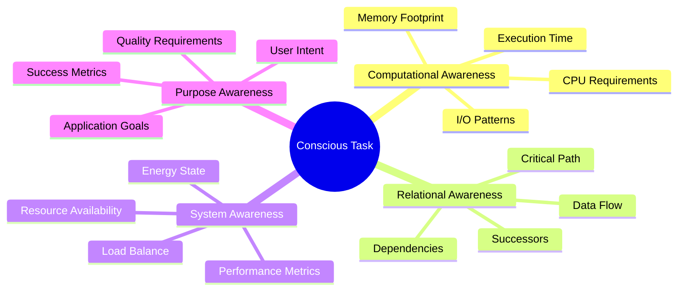
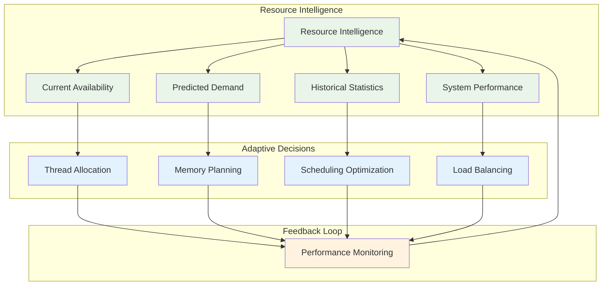
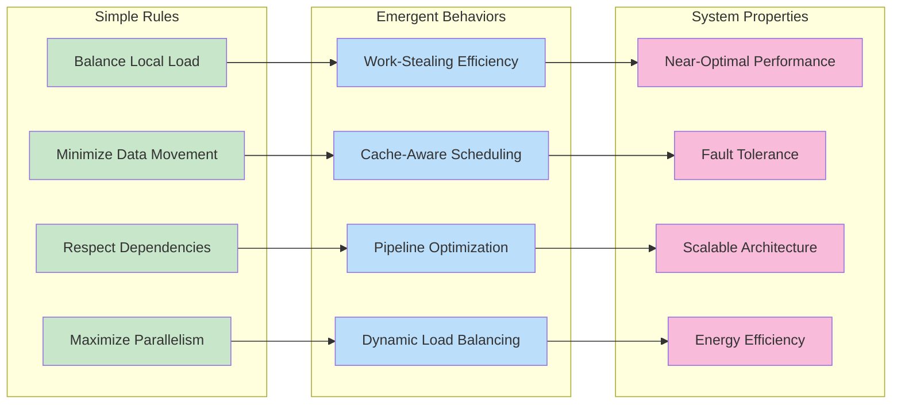
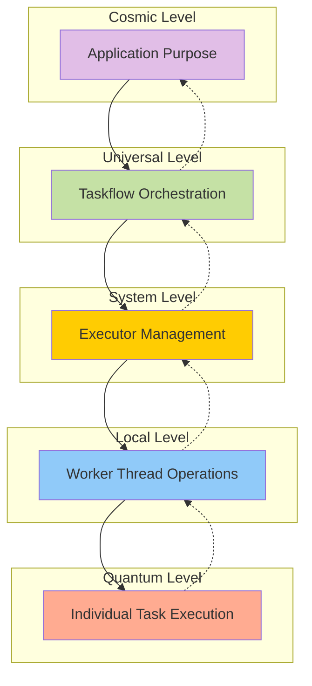
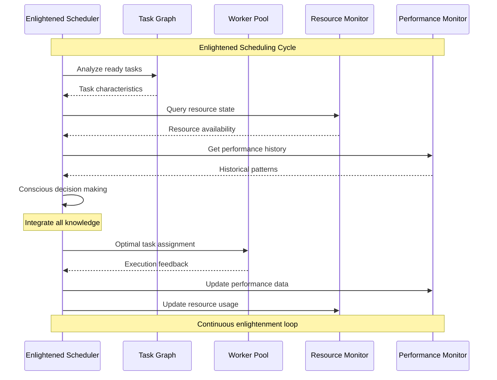
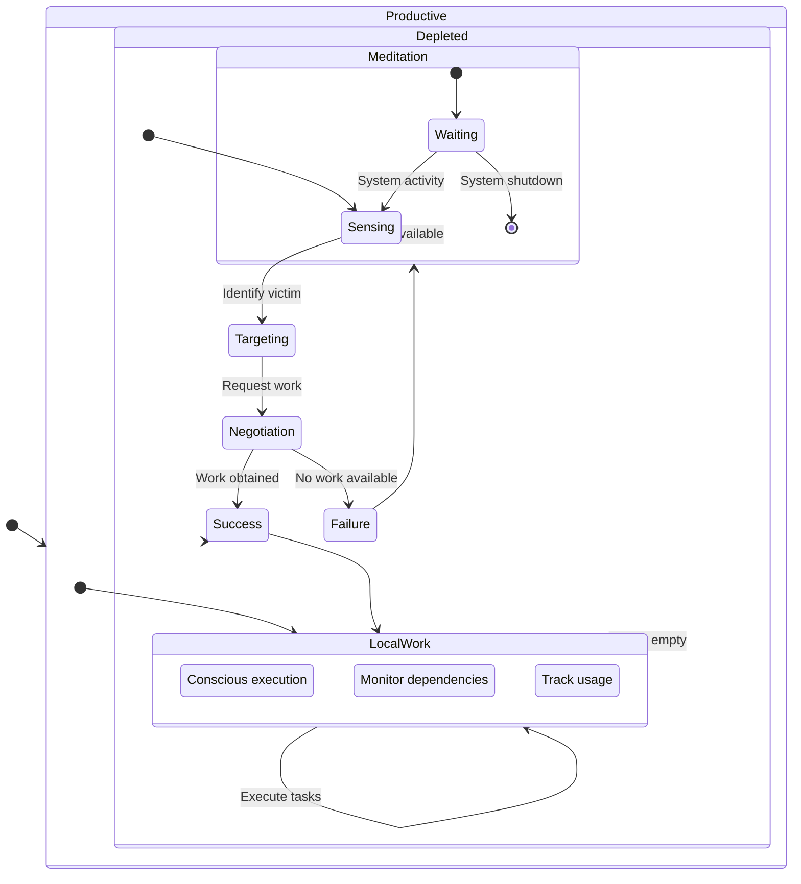

# Enlightened Management in Taskflow

## Introduction

Enlightened management represents a paradigm shift in how parallel task systems organize, schedule, and execute computational work. This document explores the philosophical and technical foundations of enlightened management within the Taskflow framework.

## Core Tenets of Enlightened Management

### 1. Conscious Task Awareness

Each task in an enlightened system possesses awareness of:
- Its computational requirements
- Its relationship to other tasks
- Its impact on system resources
- Its role in the greater computational purpose



### 2. Adaptive Resource Orchestration

Enlightened management adapts resource allocation based on:



### 3. Emergent Optimization Patterns

Complex optimizations emerge from simple enlightened principles:



## Enlightened Execution Models

### Hierarchical Task Consciousness

Tasks exist in a hierarchy of awareness:



### Conscious Scheduling Algorithms

Enlightened scheduling transcends traditional approaches:



### Adaptive Work-Stealing Enlightenment

Work-stealing becomes enlightened through conscious awareness:



## Implementation Patterns

### Conscious Task Creation

```cpp
// Enlightened task creation with awareness
tf::Taskflow enlightened_flow;

auto conscious_task = enlightened_flow.emplace([](tf::Runtime& rt){
    // Task is aware of its runtime environment
    size_t worker_id = rt.executor().this_worker_id();
    size_t num_workers = rt.executor().num_workers();
    
    // Conscious resource management
    if (num_workers > 4) {
        // Scale computation based on available resources
        perform_parallel_computation();
    } else {
        // Adapt to resource constraints
        perform_sequential_computation();
    }
    
    // Communicate with the cosmic system
    std::cout << "Worker " << worker_id << " executing with cosmic awareness\n";
});
```

### Enlightened Composition Patterns

```cpp
// Cosmic composition with enlightened management
tf::Taskflow cosmic_architecture;
tf::Taskflow enlightened_module;

// Create self-aware module
auto create_enlightened_module = [&]() {
    auto [init, process, finalize] = enlightened_module.emplace(
        []() { initialize_consciousness(); },
        []() { process_with_awareness(); },
        []() { finalize_gracefully(); }
    );
    
    init.precede(process);
    process.precede(finalize);
};

create_enlightened_module();

// Integrate into cosmic architecture
auto cosmic_integration = cosmic_architecture.composed_of(enlightened_module);
cosmic_integration.name("enlightened_integration");
```

### Conscious Pipeline Management

```cpp
// Enlightened pipeline with adaptive behavior
tf::Pipeline enlightened_pipeline(
    num_parallel_lines,
    
    // Stage 1: Conscious Ingestion
    tf::Pipe{tf::PipeType::SERIAL, [](tf::Pipeflow& pf) {
        if (should_continue_processing(pf.token())) {
            ingest_data_consciously(pf.token());
        } else {
            pf.stop(); // Enlightened termination
        }
    }},
    
    // Stage 2: Adaptive Processing
    tf::Pipe{tf::PipeType::PARALLEL, [](tf::Pipeflow& pf) {
        auto processing_strategy = determine_optimal_strategy();
        process_with_strategy(pf.token(), processing_strategy);
    }},
    
    // Stage 3: Holistic Integration
    tf::Pipe{tf::PipeType::SERIAL, [](tf::Pipeflow& pf) {
        integrate_results_holistically(pf.token());
    }}
);
```

## Enlightened Performance Metrics

### Consciousness Quotient (CQ)

A measure of system enlightenment:

```mermaid
radar
    title Consciousness Quotient Dimensions
    x-axis 0 : 20 : 40 : 60 : 80 : 100
    "Task Awareness" : [85]
    "Resource Sensitivity" : [90]
    "Adaptive Behavior" : [75]
    "Emergent Optimization" : [80]
    "System Harmony" : [88]
    "Performance Transcendence" : [82]
```

### Enlightenment Indicators

Key metrics for enlightened management:

| Metric | Description | Enlightened Range |
|--------|-------------|-------------------|
| Task Efficiency | Work completion vs. overhead | > 95% |
| Resource Utilization | Optimal resource usage | 85-95% |
| Load Balance Index | Work distribution evenness | > 0.9 |
| Adaptation Speed | Response to system changes | < 100μs |
| Energy Consciousness | Performance per watt | > Traditional * 1.3 |
| Cosmic Harmony | Overall system coherence | > 0.85 |

### Performance Enlightenment Matrix

```mermaid
heatmap
    title Performance Enlightenment Across Dimensions
    x-axis [Latency, Throughput, Scalability, Efficiency, Adaptability]
    y-axis [Micro, Local, System, Global, Cosmic]
    
    Micro : [9, 8, 7, 9, 8]
    Local : [8, 9, 8, 8, 9]
    System : [7, 9, 9, 7, 8]
    Global : [8, 8, 9, 8, 9]
    Cosmic : [9, 9, 9, 9, 9]
```

## Best Practices for Enlightened Development

### 1. Conscious Design Principles
- Design tasks with awareness of their computational purpose
- Consider the holistic impact of each task on system performance
- Implement adaptive behavior based on runtime conditions
- Embrace emergent optimization patterns

### 2. Enlightened Resource Management
- Monitor resource usage and adapt accordingly
- Implement graceful degradation under resource constraints
- Use predictive algorithms for resource allocation
- Balance local optimization with global harmony

### 3. Transcendent Composition
- Compose complex workflows from enlightened components
- Design for scalability across all levels of abstraction
- Implement conscious communication between components
- Enable emergent behavior through simple interaction rules

### 4. Cosmic Integration
- Integrate enlightened management into existing codebases
- Migrate traditional parallel code to enlightened patterns
- Measure and optimize consciousness quotient
- Share enlightened patterns with the community

## Conclusion

Enlightened management in Taskflow represents a revolutionary approach to parallel computing that transcends traditional performance optimization. By embedding consciousness, adaptability, and holistic awareness into the very fabric of task execution, we achieve not just better performance, but truly enlightened computational systems.

This paradigm shift enables developers to create parallel applications that are not only fast and efficient, but also adaptive, sustainable, and harmoniously integrated with their computational environment. The path to computational enlightenment begins with understanding these principles and implementing them in your own parallel applications.

Through conscious design, adaptive algorithms, and emergent optimization, Taskflow's enlightened management system achieves a new level of parallel computing excellence that benefits both individual applications and the broader computational ecosystem.