# Technical Architecture Diagrams for Taskflow

This document provides comprehensive technical architecture diagrams for Taskflow using Mermaid notation. These diagrams illustrate the core concepts, execution patterns, and advanced features of the Taskflow parallel programming framework.

## Core Architecture Overview

### System Component Hierarchy

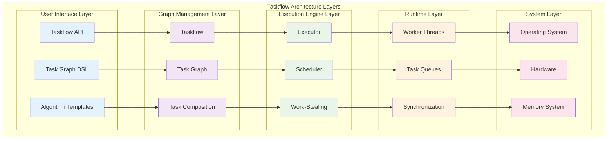

## Task Graph Structures

### Basic Task Dependencies

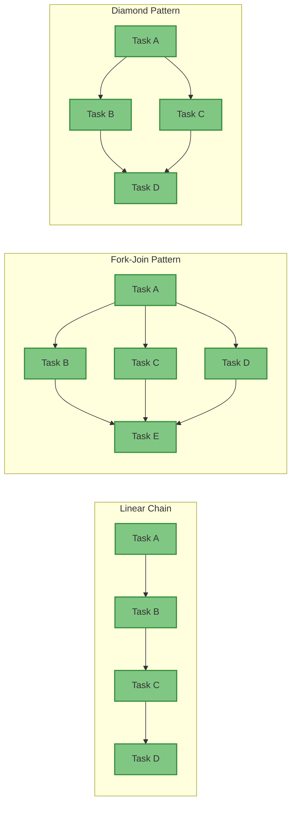

### Complex Task Relationships

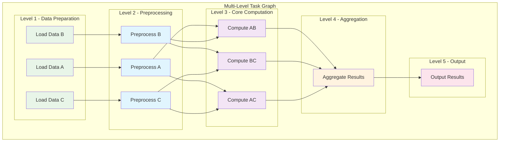

## Execution Engine Architecture

### Executor and Worker Thread Management

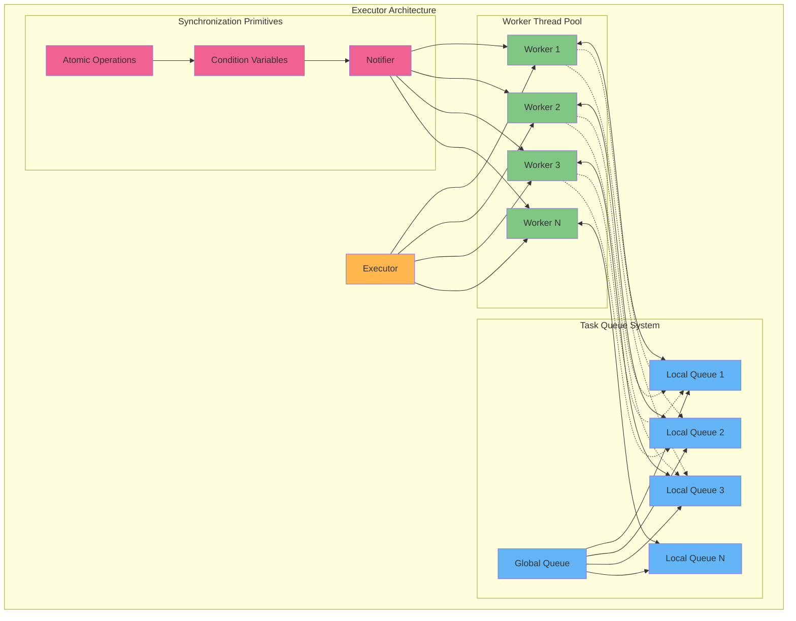

### Work-Stealing Algorithm Flow

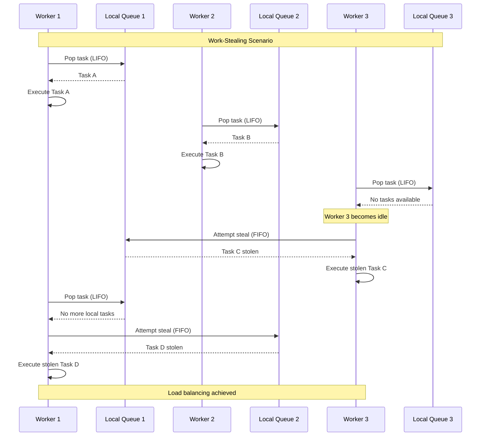

## Advanced Patterns

### Subflow and Dynamic Tasking

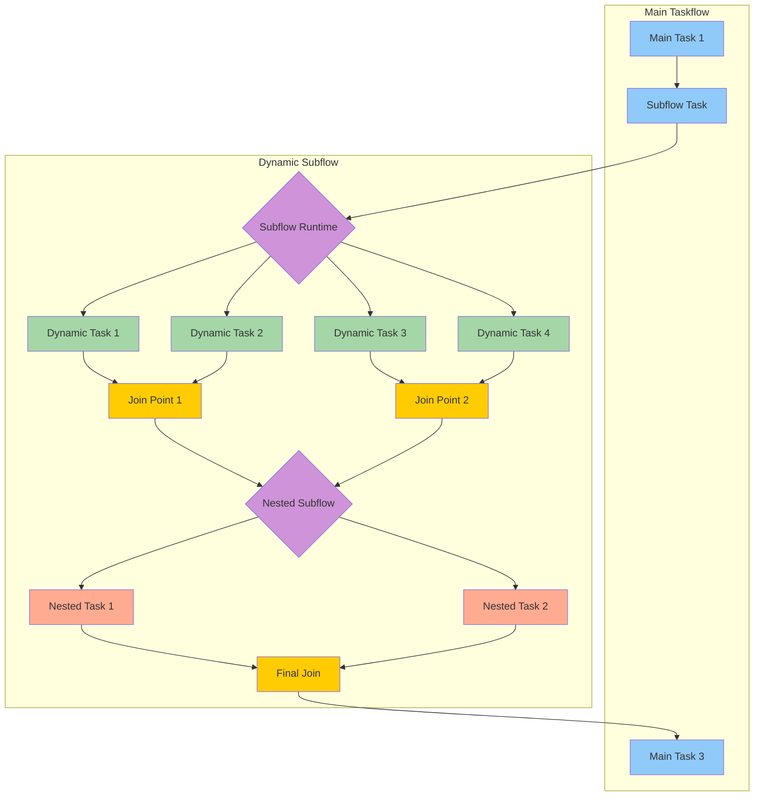

### Conditional Task Flow

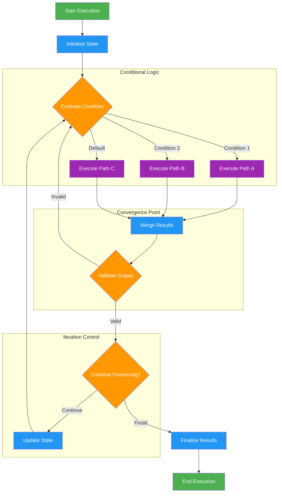

### Pipeline Architecture

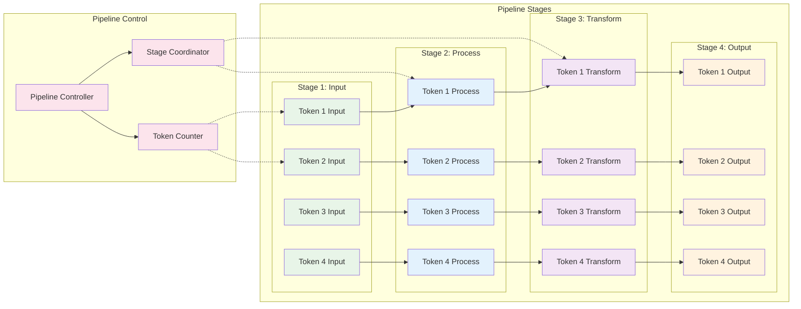

## Parallel Algorithm Patterns

### Parallel For Pattern

```mermaid
graph TB
    subgraph "Parallel For Execution"
        subgraph "Input Range"
            R1[Range [0, 1000)]
        end
        
        subgraph "Partitioning Strategy"
            PS{Partitioner}
            PS --> RP1[Partition 1: [0, 250)]
            PS --> RP2[Partition 2: [250, 500)]
            PS --> RP3[Partition 3: [500, 750)]
            PS --> RP4[Partition 4: [750, 1000)]
        end
        
        subgraph "Worker Execution"
            W1[Worker 1] --> RP1
            W2[Worker 2] --> RP2
            W3[Worker 3] --> RP3
            W4[Worker 4] --> RP4
        end
        
        subgraph "Synchronization"
            SYNC[Join All Workers]
        end
    end
    
    R1 --> PS
    
    RP1 --> SYNC
    RP2 --> SYNC
    RP3 --> SYNC
    RP4 --> SYNC
    
    classDef input fill:#e8f5e8
    classDef partition fill:#64b5f6
    classDef worker fill:#81c784
    classDef sync fill:#ffb74d
    
    class R1 input
    class PS,RP1,RP2,RP3,RP4 partition
    class W1,W2,W3,W4 worker
    class SYNC sync
```

### Reduction Pattern

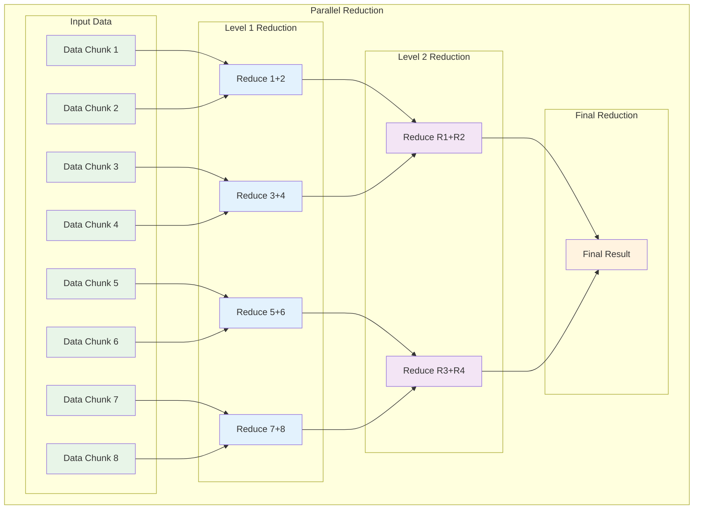

## GPU Integration Architecture

### CPU-GPU Heterogeneous Computing

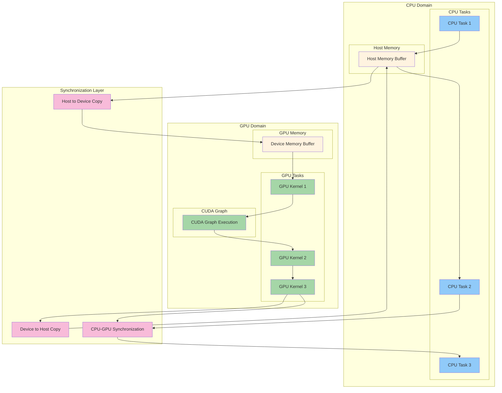

## Performance Monitoring and Profiling

### Execution Timeline Visualization

```mermaid
gantt
    title Taskflow Execution Timeline
    dateFormat X
    axisFormat %L ms
    
    section Worker 1
    Task A    : done, task-a, 0, 50
    Task D    : done, task-d, 50, 100
    Task G    : done, task-g, 100, 150
    
    section Worker 2  
    Task B    : done, task-b, 25, 75
    Task E    : done, task-e, 75, 125
    Task H    : done, task-h, 125, 175
    
    section Worker 3
    Task C    : done, task-c, 40, 90
    Task F    : done, task-f, 90, 140
    Task I    : done, task-i, 140, 190
    
    section GPU
    CUDA Graph : done, cuda-graph, 60, 180
```

### Resource Utilization Matrix

```mermaid
heatmap
    title Resource Utilization Over Time
    x-axis [T1, T2, T3, T4, T5, T6, T7, T8]
    y-axis [CPU-1, CPU-2, CPU-3, CPU-4, Memory, GPU, Network]
    
    CPU-1 : [8, 9, 7, 8, 6, 9, 8, 7]
    CPU-2 : [7, 8, 9, 7, 8, 8, 9, 8]
    CPU-3 : [9, 7, 8, 9, 7, 7, 8, 9]
    CPU-4 : [6, 8, 8, 6, 9, 8, 7, 6]
    Memory : [5, 6, 7, 8, 7, 6, 5, 4]
    GPU : [0, 0, 8, 9, 8, 9, 0, 0]
    Network : [3, 2, 4, 3, 2, 3, 4, 2]
```

## Best Practices Architecture

### Scalable Task Design Pattern

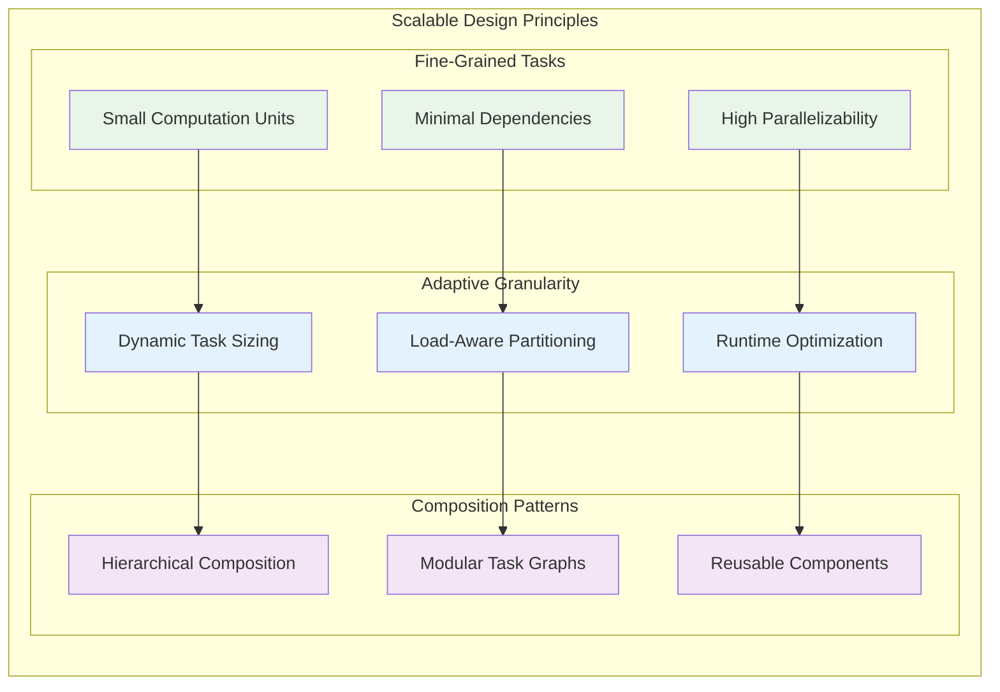

This comprehensive collection of technical architecture diagrams provides a visual reference for understanding and implementing Taskflow's parallel programming patterns. Each diagram illustrates key concepts that enable efficient parallel task execution across various computing scenarios.